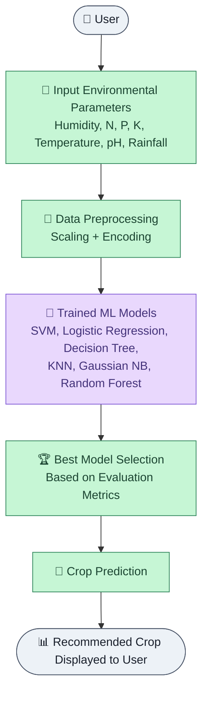

# 🌾 Crop Prediction System

Crop Prediction System is a machine learning–based application that recommends the most suitable crop to cultivate based on environmental and soil parameters. Built using **Python** and multiple classical machine learning algorithms, the system helps farmers and agricultural stakeholders make informed, data-driven cultivation decisions.

This project was developed as part of a university academic project for the **Data Mining (CSL495)** course, demonstrating practical applications of **data preprocessing, exploratory data analysis, classification modeling, and model evaluation**.

---

## ✨ Features

- 🌱 Predicts the most suitable crop based on environmental inputs
- 📊 Uses 6 different machine learning models for comparison
- 🧪 Inputs: humidity, nitrogen, phosphorus, potassium, temperature, pH, and rainfall
- 🏆 Automatically selects the best-performing model based on evaluation metrics
- 📈 Supports comparative performance analysis across all models
- 🖥️ Simple interface for entering environmental data and viewing predictions

---

## 🧠 Machine Learning Models Used

| Model | Description |
|-------|--------------|
| Support Vector Machine (SVM) | Classification using optimal decision boundaries |
| Logistic Regression | Baseline linear classification model |
| Decision Tree | Rule-based classification model |
| K-Nearest Neighbors (KNN) | Distance-based classification |
| Gaussian Naive Bayes | Probabilistic classification model |
| Random Forest | Ensemble-based classification model |

Each model is evaluated using **accuracy, precision, recall, and F1-score**, and the best-performing model is used for final crop predictions.

---

## 🏗️ System Architecture



---

## 🛠️ Tech Stack

| Category | Technologies |
|----------|--------------|
| Programming Language | Python |
| Machine Learning | Scikit-learn |
| Data Handling | Pandas, NumPy |
| Data Visualization | Matplotlib, Seaborn |
| Model Persistence | Pickle (.pkl) |
| Application | app.py (Python-based interface) |

---

## ⚙️ Installation

### Prerequisites

Before running the project, install:

- Python **3.10+**
- Visual Studio Code (Recommended)

---

### 1️⃣ Download the Project

Go to the GitHub repository, click **Code → Download ZIP**, then extract the ZIP file to a location of your choice.

Alternatively, use:

```bash
git clone https://github.com/anmolzehra313/Crop-Prediction-System.git
```

---

### 2️⃣ Navigate to the Project Folder

```bash
cd Crop-Prediction-System
```

---

### 3️⃣ Create a Virtual Environment (Optional)

Windows

```bash
python -m venv venv
venv\Scripts\activate
```

Linux/macOS

```bash
python3 -m venv venv
source venv/bin/activate
```

---

### 4️⃣ Install Dependencies

```bash
pip install -r requirements.txt
```

---

### 5️⃣ Run the Application

```bash
python app.py
```

---

## 📁 Project Structure

```text
Crop-Prediction-System/
│
├── Crops_recommendation (2).csv     # Dataset used for training and evaluation
├── Model_Training_SVM.pkl           # Trained SVM model
├── Model_Training_Logistic.pkl      # Trained Logistic Regression model
├── Model_Training_Decision.pkl      # Trained Decision Tree model
├── Model_Training_KNN.pkl           # Trained KNN model
├── Model_Training_Gussian.pkl       # Trained Gaussian Naive Bayes model
├── Model_Training_Random.pkl        # Trained Random Forest model
├── label_encoder.pkl                # Encoder for crop labels
├── scaler.pkl                       # Feature scaler
├── selector.pkl                     # Feature selector
├── app.py                           # Main application script
├── requirements.txt                 # Project dependencies
└── README.md
```

---

## 🚀 Future Improvements

- Support additional environmental parameters for improved accuracy
- Deploy as a web application with a richer front-end interface
- Add real-time weather API integration for automated input
- Enable multi-crop confidence-based recommendations
- Add model retraining pipeline with updated agricultural datasets

---

## 👥 Contributors & Attribution

This project was originally developed collaboratively as a university team project (Course: Data Mining – CSL495, Bahria University Karachi Campus) by **Syeda Anmol Zahra Jaffary** and **Muhammad Sarim Shaikh**. This repository is maintained solely by Syeda Anmol Zahra Jaffary for educational and portfolio purposes; no claim is made that the project was built exclusively by a single contributor.

---

## 📄 License

No formal license has been specified. This project is shared for educational, research, and portfolio purposes only. All original contributors retain credit for their respective work on the academic project.

---

## ⭐ Support

If you found this project useful, please consider giving it a **⭐ Star** on GitHub.

Your support is greatly appreciated and helps showcase the project to the developer community.
